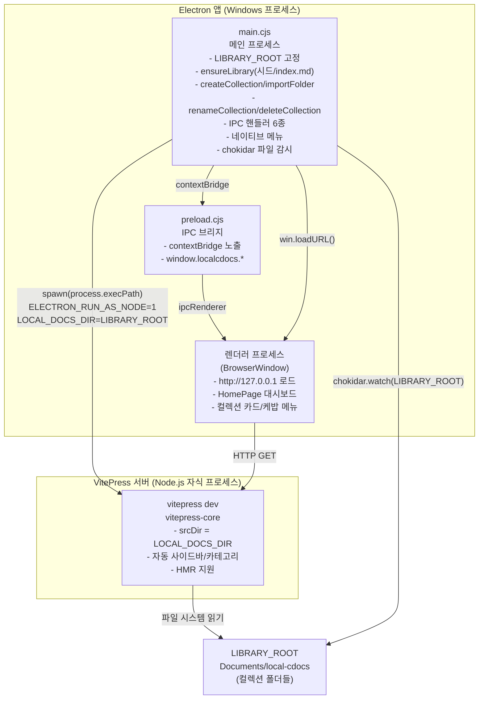
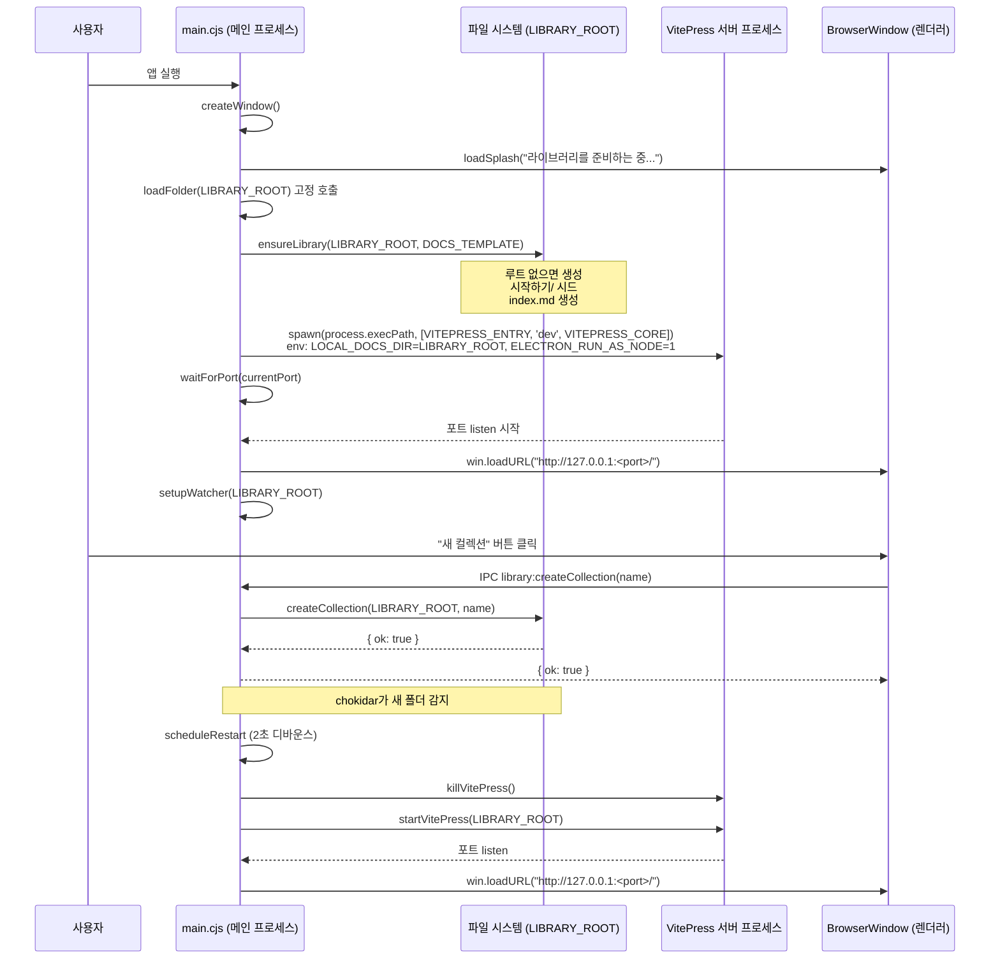

<!-- 01-architecture.md: local_cdocs 전체 아키텍처 설명 | 생성일: 2026-06-22 | 수정일: 2026-06-22 -->

# 01. 전체 아키텍처

## 개요

local_cdocs는 **관리형 라이브러리(Managed Library)** 모델로 동작하는 Electron 데스크톱 앱입니다.
사용자는 `Documents/local-cdocs` 고정 루트를 항상 열고, 그 안의 컬렉션 폴더를 앱 UI에서 관리합니다.

세 개의 독립 레이어(layer)로 구성됩니다.

1. **Electron 메인 프로세스(Main Process)** — 앱 생명주기, 창 관리, 라이브러리 fs 작업(생성·가져오기·이름변경·삭제), VitePress 자식 프로세스 기동/종료, IPC 핸들러
2. **VitePress Dev Server** — Node.js 자식 프로세스로 실행. Markdown → HTML 렌더링, 자동 사이드바 생성
3. **Electron 렌더러 프로세스(Renderer)** — BrowserWindow가 `http://127.0.0.1:<port>` 를 로드하는 웹뷰. preload.cjs를 통해 IPC 접근

---

## 디렉토리 구조

```
local_cdocs/
├── electron/
│   ├── main.cjs          # 메인 프로세스: 라이브러리 fs, VitePress 기동, IPC 핸들러
│   ├── preload.cjs       # 렌더러 ↔ 메인 IPC 브리지 (contextBridge)
│   └── splash.html       # 서버 기동 대기 화면
├── vitepress-core/
│   └── .vitepress/
│       ├── config.mts    # docsRoot를 LOCAL_DOCS_DIR ENV로 동적 주입, 자동 사이드바
│       └── theme/        # 커스텀 테마·컴포넌트(CategoryDropdown, HomePage 등)
├── docs-template/        # 최초 실행 시 시드되는 "시작하기" 컬렉션 원본
├── docs/                 # 개발자 설계 문서 (지금 보고 있는 파일)
├── package.json
└── electron-builder.yml  # Windows 패키징 설정
```

> **과거 모델 폐기** — 이전 설계에 있던 `electron-store`(lastFolder 영속), "폴더 열기" 다이얼로그,
> `server.cjs` 래퍼는 현재 구현에 존재하지 않습니다. 고정 `LIBRARY_ROOT`로 대체되었습니다.

---

## 관리형 라이브러리 동작 모델

```
Documents/local-cdocs/          ← LIBRARY_ROOT (고정 라이브러리 루트 = VitePress srcDir)
├── index.md                    ← <HomePage /> 마운트. 앱이 자동 생성/관리
├── 시작하기/                   ← 최초 실행 시 docs-template/ 내용으로 시드
│   └── index.md
├── 내프로젝트A/                ← 사용자가 "새 컬렉션"으로 생성
│   ├── index.md
│   └── ...
└── 가져온문서/                 ← 사용자가 "폴더 가져오기"로 외부 폴더를 복사
    └── ...
```

- 컬렉션 = LIBRARY_ROOT 직속 폴더 → `config.mts`의 "폴더=카테고리" 로직이 그대로 적용됨
- 컬렉션 생성/삭제 후 chokidar가 감지 → 서버 재시작 → 화면 자동 갱신

---

## 컴포넌트 다이어그램



---

## 프로세스 모델

| 프로세스 | 런타임 | 역할 |
|---------|--------|------|
| Electron 메인 | Node.js (Electron 내장, CommonJS) | 앱 생명주기, OS 연동, 라이브러리 fs, IPC 핸들러 |
| VitePress Dev Server | Node.js 자식 프로세스 (ESM) | Markdown → HTML, 자동 사이드바, HMR |
| Electron 렌더러 | Chromium | UI 표시 (localhost HTTP 로드), 컬렉션 대시보드 |

> **왜 자식 프로세스인가?**
> Electron 메인은 CommonJS(`.cjs`)이고 VitePress는 ESM 전용입니다.
> 같은 프로세스 내에서 혼용하면 `require`/`import` 충돌이 발생합니다.
> VitePress를 별도 자식 프로세스로 분리하면 런타임 충돌을 완전히 회피할 수 있고,
> 파일 변경 시 kill → respawn 패턴도 자연스럽게 구현됩니다.

> **왜 `process.execPath + ELECTRON_RUN_AS_NODE`인가?**
> Linux에서 빌드한 패키지를 Windows에 배포할 때 `.bin/vitepress.cmd` 셰임(shim)이
> 존재하지 않습니다. Electron 실행 파일을 `ELECTRON_RUN_AS_NODE=1`로 순수 Node처럼
> 구동하면 별도 node.exe 없이 크로스플랫폼으로 동작합니다.

---

## 동작 흐름 (시퀀스)



---

## 핵심 코드 발췌: 고정 라이브러리 루트와 창 생성

`electron/main.cjs`에서 `LIBRARY_ROOT`를 상수로 정의하고, 창 생성 시 항상 이 경로를 엽니다.

```js
// ── 경로 상수 ──────────────────────────────────────────────
const LIBRARY_ROOT = path.join(app.getPath('documents'), 'local-cdocs')

// VitePress CLI JS 진입점. .bin/*.cmd 셰임에 의존하지 않고
// Electron 실행파일을 node 모드(ELECTRON_RUN_AS_NODE=1)로 직접 구동.
const VITEPRESS_ENTRY = path.join(APP_ROOT, 'node_modules', 'vitepress', 'bin', 'vitepress.js')
```

```js
// ── 창 생성 ────────────────────────────────────────────────
function createWindow() {
  win = new BrowserWindow({
    width: 1400, height: 900,
    title: 'local-cdocs',
    webPreferences: {
      preload: path.join(__dirname, 'preload.cjs'),
      contextIsolation: true,
      nodeIntegration: false,
    },
  })
  buildMenu()
  loadSplash('라이브러리를 준비하는 중...')

  // 관리형 라이브러리: 항상 고정 루트를 연다.
  loadFolder(LIBRARY_ROOT)
}
```

---

## 핵심 코드 발췌: ensureLibrary (최초 시드)

앱 실행마다 `ensureLibrary`를 호출하지만 이미 존재하면 건드리지 않습니다(idempotent).

```js
// 라이브러리 루트 보장 + 최초 시드(시작하기 컬렉션 + 루트 index.md).
function ensureLibrary(root, templateDir) {
  fs.mkdirSync(root, { recursive: true })

  // 시작하기 컬렉션 시드: docs-template/ 내용을 복사. 폴더가 없을 때만.
  const seedDir = path.join(root, '시작하기')
  if (!fs.existsSync(seedDir) && fs.existsSync(templateDir)) {
    fs.cpSync(templateDir, seedDir, { recursive: true })
  }

  // 루트 index.md(라이브러리 대시보드 = HomePage). 없을 때만 생성.
  const indexPath = path.join(root, 'index.md')
  if (!fs.existsSync(indexPath)) {
    fs.writeFileSync(indexPath, '---\nlayout: page\n---\n\n<HomePage />\n', 'utf-8')
  }
}
```

---

## 핵심 코드 발췌: startVitePress

```js
async function startVitePress(folder) {
  await killVitePress()
  currentPort = await getPort()   // get-port v5로 빈 포트 동적 할당

  const env = {
    ...process.env,
    LOCAL_DOCS_DIR: folder,
    LOCAL_DOCS_PORT: String(currentPort),
    ELECTRON_RUN_AS_NODE: '1',    // Electron exe를 순수 node처럼 동작
  }

  // process.execPath(Electron exe)를 node 모드로 사용 — shell 불필요
  vpProcess = spawn(process.execPath, [VITEPRESS_ENTRY, 'dev', VITEPRESS_CORE], {
    cwd: APP_ROOT, env, windowsHide: true,
  })

  await waitForPort(currentPort)  // 포트 listen 대기 후 반환
  return currentPort
}
```

---

## 포트 관리

- `get-port` v5 라이브러리로 빈 포트를 동적 할당합니다.
- `LOCAL_DOCS_PORT` ENV로 VitePress에 주입, `config.mts`의 `vite.server.port`가 이를 읽습니다.
- `strictPort: true`로 설정해 지정 포트 외 다른 포트로 이동을 방지합니다.
- 매 재시작마다 새 포트를 할당하므로 포트 충돌 없이 안전하게 기동합니다.

---

## IPC 계약 (window.localcdocs)

preload.cjs가 `contextBridge`로 렌더러에 노출하는 API입니다.

| IPC 채널 | 메서드 | 설명 |
|----------|--------|------|
| `library:getRoot` | `getRoot()` | LIBRARY_ROOT 경로 반환 |
| `library:createCollection` | `createCollection(name)` | 새 컬렉션 폴더 + index.md 생성 |
| `library:importFolder` | `importFolder()` | 폴더 선택 다이얼로그 → LIBRARY_ROOT로 복사 |
| `library:renameCollection` | `renameCollection(dir, newName)` | 폴더 이름 변경 |
| `library:deleteCollection` | `deleteCollection(dir)` | 휴지통으로 이동 (영구 삭제 금지) |
| `library:reveal` | `reveal(dir?)` | 탐색기에서 폴더 열기 |

---

## 앱 라이프사이클 정리

| 시점 | 동작 |
|------|------|
| `app.whenReady()` | `createWindow()` → `loadFolder(LIBRARY_ROOT)` |
| 창 생성 직후 | `splash.html` 표시 → VitePress 기동 대기 |
| VitePress 포트 listen 완료 | `win.loadURL("http://127.0.0.1:<port>/")` |
| chokidar 변경 감지 | 2초 디바운스 후 재시작 |
| `window-all-closed` | watcher.close() + killVitePress() + app.quit() |
| `before-quit` | vpProcess/watcher 확실히 정리 (좀비 방지) |
