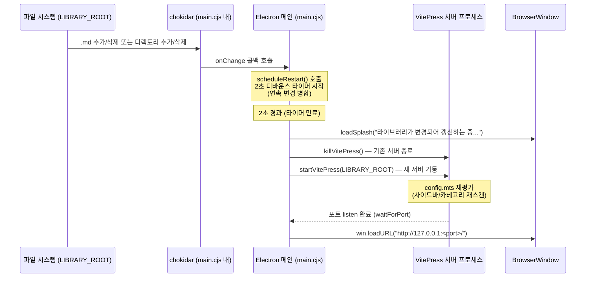

<!-- 04-realtime-watch.md: chokidar 실시간 감지 → 디바운스 재시작 → 창 reload 흐름 | 생성일: 2026-06-22 | 수정일: 2026-06-22 -->

# 04. 실시간 파일 감시

## 개요

사용자가 컬렉션을 생성하거나 폴더를 가져오면(또는 직접 파일을 추가/삭제하면)
사이드바와 카테고리 목록이 자동으로 갱신됩니다.

구현은 **Electron 메인 프로세스의 chokidar 감시** 하나로 일원화되어 있습니다.
(VitePress 내장 플러그인 `auto-restart-on-new-docs`는 Electron 셸 구동 시 비활성 — 아래 참조)

---

## 전체 흐름



---

## chokidar 감시 설정 (setupWatcher)

`loadFolder()` 성공 후 `setupWatcher(folder)`를 호출합니다.
폴더가 바뀌거나 재시작될 때마다 기존 watcher를 닫고 새로 엽니다.

```js
// ── chokidar로 폴더 watch → .md/디렉토리 변경 시 디바운스 재시작 ──
function setupWatcher(folder) {
  if (watcher) { watcher.close(); watcher = null }

  watcher = chokidar.watch(folder, {
    ignored: /(^|[/\\])\.|node_modules/, // 숨김 파일/node_modules 무시
    ignoreInitial: true,  // 초기 스캔 이벤트 무시
    persistent: true,
    depth: 99,
  })

  const onChange = (reason) => () => scheduleRestart(reason)

  watcher
    .on('add', (p) => { if (p.endsWith('.md')) scheduleRestart(`새 문서: ${p}`) })
    .on('unlink', (p) => { if (p.endsWith('.md')) scheduleRestart(`문서 삭제: ${p}`) })
    .on('addDir', onChange('새 디렉토리'))
    .on('unlinkDir', onChange('디렉토리 삭제'))
}
```

### 감시 이벤트 종류

| 이벤트 | 조건 | 재시작 트리거 |
|--------|------|:---:|
| `add` | `.md` 파일 추가 | O |
| `unlink` | `.md` 파일 삭제 | O |
| `addDir` | 디렉토리 추가 | O |
| `unlinkDir` | 디렉토리 삭제 | O |
| `change` | 파일 내용 변경 | X |

> **`change`는 재시작하지 않는 이유**: 파일 내용 변경은 사이드바 구조에 영향을 주지 않습니다.
> VitePress 내장 HMR이 페이지를 즉시 갱신하므로 서버 재시작 없이 반영됩니다.
> 재시작은 사이드바/카테고리 재생성이 필요한 구조적 변경(파일·폴더 추가/삭제)에만 사용합니다.

---

## 디바운스 재시작 (scheduleRestart)

파일을 대량 복사하거나 컬렉션 가져오기 시 이벤트가 연속으로 발생합니다.
매번 서버를 재시작하면 과부하가 생기므로 **마지막 이벤트 이후 2초**가 지나야 재시작합니다.

```js
// ── 디바운스 2초 후 서버 재시작 → 창 reload ───────────────
function scheduleRestart(reason) {
  console.log(`[local-cdocs] 변경 감지: ${reason}`)
  if (restartTimer) clearTimeout(restartTimer)
  restartTimer = setTimeout(async () => {
    if (isRestarting || !currentFolder) return
    isRestarting = true
    loadSplash('라이브러리가 변경되어 갱신하는 중...')
    try {
      const port = await startVitePress(currentFolder)
      await win.loadURL(`http://127.0.0.1:${port}/`)
    } catch (e) {
      console.error('[local-cdocs] 재시작 실패:', e)
      loadSplash('재시작 실패: ' + e.message)
    } finally {
      isRestarting = false
    }
  }, 2000)
}
```

- `restartTimer`: 기존 타이머를 취소하고 새 타이머를 설정 (디바운스 핵심)
- `isRestarting` 가드: 재시작 중 중복 재시작 방지
- 재시작 완료 후 `win.loadURL()`로 화면 갱신 (홈 `/`로 이동)

디바운스 타이밍:

```
이벤트: ─── add ─── add ─── add ─────────── [2초 경과] ─── 재시작
             ↑       ↑       ↑                              ↑
         타이머취소 타이머취소 타이머취소           타이머만료 → 재시작
```

---

## VitePress 자식 프로세스 종료 (killVitePress)

좀비 프로세스 방지를 위해 플랫폼별 종료 전략을 사용합니다.

```js
// ── VitePress 자식 프로세스 종료(좀비 방지) ────────────────
function killVitePress() {
  return new Promise((resolve) => {
    if (!vpProcess) return resolve()
    const proc = vpProcess
    vpProcess = null
    proc.removeAllListeners('exit')
    proc.once('exit', () => resolve())
    try {
      if (process.platform === 'win32') {
        // Windows: 프로세스 트리 전체 종료
        spawn('taskkill', ['/pid', String(proc.pid), '/t', '/f'])
      } else {
        proc.kill('SIGTERM')
      }
    } catch {
      resolve()
    }
    // 안전장치: 2초 내 미종료 시 강제 resolve
    setTimeout(resolve, 2000)
  })
}
```

| 플랫폼 | 종료 방식 | 이유 |
|--------|----------|------|
| Windows | `taskkill /pid <pid> /t /f` | 자식 프로세스 트리 전체 강제 종료 |
| Linux/macOS | `proc.kill('SIGTERM')` | 표준 종료 시그널 |
| 공통 | 2초 안전장치 | 미종료 시 Promise를 강제 resolve해 deadlock 방지 |

`vpProcess = null`을 먼저 설정하고 `removeAllListeners('exit')`를 호출해
기존 exit 핸들러가 오동작하지 않도록 합니다.

---

## 앱 라이프사이클별 정리

```js
// 모든 창 종료 시 자식 프로세스 정리 후 앱 종료
app.on('window-all-closed', async () => {
  if (watcher) { await watcher.close(); watcher = null }
  await killVitePress()
  if (process.platform !== 'darwin') app.quit()
})

// 종료 직전 자식 VitePress 프로세스 확실히 정리(좀비 방지)
app.on('before-quit', async (e) => {
  if (vpProcess || watcher) {
    e.preventDefault()
    if (watcher) { await watcher.close(); watcher = null }
    await killVitePress()
    app.exit(0)
  }
})
```

- `window-all-closed`: 창이 닫힐 때 watcher + VitePress 정리
- `before-quit`: `e.preventDefault()`로 즉시 종료를 막고 비동기 정리 후 `app.exit(0)` 호출
- 두 핸들러가 겹쳐도 `vpProcess = null` 선제 설정으로 중복 kill 방지

---

## VitePress 내장 플러그인과의 관계

`config.mts`에 `auto-restart-on-new-docs` Vite 플러그인이 구현되어 있지만,
**Electron 셸 구동 시에는 비활성**됩니다.

```ts
configureServer(server) {
  // Electron 셸에서 구동될 때(LOCAL_DOCS_DIR 설정됨)는 재시작 주체를 Electron(main.cjs)으로 일원화한다.
  // 이 경우 Electron이 chokidar로 watch → 자식 프로세스를 kill/respawn 하므로 플러그인은 비활성.
  // ENV 미설정(CLI 단독 구동) 시에만 plugin이 process.exit로 재시작을 유도한다.
  if (process.env.LOCAL_DOCS_DIR) return

  // CLI 단독 구동 시에만 아래 로직 활성
  const watcher = server.watcher
  // ... scheduleRestart → process.exit(0)
}
```

| 구동 방식 | 감시 주체 | 재시작 방식 |
|----------|----------|-----------|
| Electron 앱 (`LOCAL_DOCS_DIR` 설정됨) | `main.cjs` chokidar | `killVitePress()` + `startVitePress()` |
| CLI 단독 (`npm run vp:dev`) | VitePress 내장 플러그인 | `process.exit(0)` → 외부 루프 재시작 |

---

## 포트 ready 감지 (waitForPort)

`startVitePress()` 내부에서 포트가 실제로 listen될 때까지 기다린 후 창을 로드합니다.
이를 통해 "서버가 아직 준비 안 됐는데 URL 로드" 문제를 방지합니다.

```js
// ── 유틸: 포트가 응답할 때까지 대기(서버 ready 감지) ───────
function waitForPort(port, { timeout = 60000, interval = 250 } = {}) {
  const deadline = Date.now() + timeout
  return new Promise((resolve, reject) => {
    const tryConnect = () => {
      const socket = net.connect(port, '127.0.0.1')
      socket.once('connect', () => { socket.destroy(); resolve() })
      socket.once('error', () => {
        socket.destroy()
        if (Date.now() > deadline) return reject(new Error('VitePress 서버 응답 시간 초과'))
        setTimeout(tryConnect, interval)
      })
    }
    tryConnect()
  })
}
```

- 250ms 간격으로 TCP 연결 시도
- 60초 이내 미응답 시 reject → `loadSplash("문서 서버 기동에 실패했습니다")` 표시
- 연결 성공 시 소켓 즉시 파괴 후 resolve

---

## 전체 재시작 흐름 요약

```
[IPC: createCollection] 또는 [chokidar: addDir/add]
           ↓
    scheduleRestart() — 2초 디바운스
           ↓
    loadSplash("갱신하는 중...")
           ↓
    killVitePress()
      Windows: taskkill /t /f
      Linux  : SIGTERM
           ↓
    startVitePress(LIBRARY_ROOT)
      spawn(process.execPath, [VITEPRESS_ENTRY, 'dev', VITEPRESS_CORE])
      env: LOCAL_DOCS_DIR, LOCAL_DOCS_PORT, ELECTRON_RUN_AS_NODE=1
           ↓
    waitForPort(newPort) — TCP 폴링 250ms 간격
           ↓
    win.loadURL("http://127.0.0.1:<newPort>/")
```
