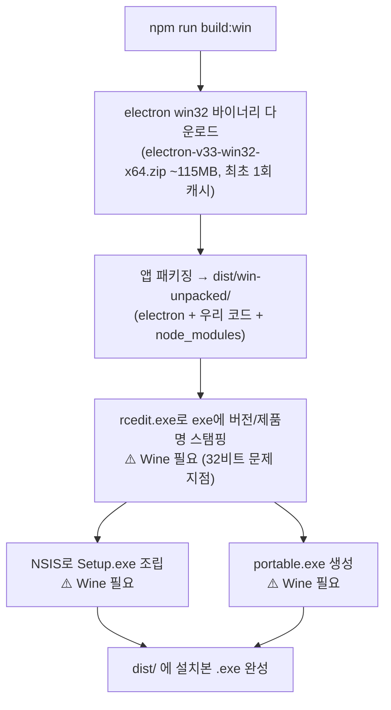

<!-- 07-windows-build-on-linux.md: Linux/WSL에서 Windows .exe 빌드 - Wine 설명 및 재현 절차 | 생성일: 2026-06-22 -->

# Linux/WSL에서 Windows 설치본(.exe) 빌드 — Wine 설명과 재현 절차

이 문서는 **Linux(WSL) 환경에서 Windows용 설치본 `.exe`를 만들 때** 필요한 작업과
그 과정에서 등장하는 **Wine**이 무엇인지 설명한다. 누구나 이 문서만 보고 처음부터 다시 빌드할 수 있도록 정리했다.

## 1. Wine이란?

**Wine(Wine Is Not an Emulator)**은 Linux/macOS에서 **Windows용 프로그램(.exe)을 그대로 실행**하게 해주는 호환성 계층(compatibility layer)이다.

- 에뮬레이터가 아니다 — Windows를 가상으로 돌리는 게 아니라, Windows API 호출을 **실시간으로 Linux의 동등한 호출로 번역**한다. 그래서 가상머신보다 가볍고 빠르다.
- 우리 프로젝트에서 Wine이 필요한 이유: `electron-builder`가 Windows 설치본을 만들 때, **Windows 전용 도구들을 실행**해야 하기 때문이다.
  - `rcedit.exe` — 생성된 `local-cdocs.exe`에 **버전 정보·아이콘·제품명 메타데이터를 새기는** Windows 도구.
  - NSIS(`makensis`) 계열 — **설치 마법사(Setup.exe)를 조립**하는 Windows 도구.
  - 이 도구들 자체가 `.exe`라서, Linux에서 실행하려면 Wine이 반드시 필요하다.

> 정리: **앱 패키징(win-unpacked 폴더 생성)은 Wine 없이 되지만, "설치본 .exe로 포장"하는 마지막 단계는 Windows 도구를 돌려야 해서 Wine이 필요**하다.

## 2. 32비트 문제 (wine32 / wow64) — 실제로 두 군데서 발생

Ubuntu/WSL에 기본 설치되는 `wine`은 **64비트 전용**이다. 하지만 electron-builder가 빌드 중 실행하는
일부 도구는 **32비트 exe**라, 64비트 wine만으로는 `wine32 is missing` 에러가 난다.
이 프로젝트 빌드에서는 **32비트 요구가 두 단계**에 걸쳐 나타났다.

증상(로그):
```
it looks like wine32 is missing, you should install it.
wine: failed to load ...syswow64\ntdll.dll error c0000135
```

### 32비트가 필요한 두 단계

| 단계 | 실행 도구 | 우회 가능? |
|------|-----------|-----------|
| ① exe 버전 스탬핑 | `rcedit-ia32.exe` (32비트) | ✅ 가능 — 아래 B 방법 |
| ② NSIS 언인스톨러 생성 | 갓 만든 `Setup.exe` (32비트 NSIS 스텁)를 실행 | ❌ 불가 — `wine32:i386` 필수 |

→ **②는 NSIS 설치본 스텁 자체가 32비트라 64비트로 바꿔치기할 수 없다.**
따라서 **Linux에서 완전한 NSIS 설치본을 만들려면 결국 `wine32:i386` 설치가 필요**하다.

### A. wine32 설치 (정석 — 완전한 설치본을 위해 사실상 필수, root 권한 필요)
```bash
sudo dpkg --add-architecture i386      # 32비트 아키텍처 활성화
sudo apt-get update
sudo apt-get install -y wine32:i386    # 32비트 wine 설치
```
이걸 설치하면 ①·② **둘 다 해결**되므로, 아래 B 방법은 사실 필요 없어진다.

### B. rcedit을 64비트로 교체 (①만 우회, sudo 불필요)
winCodeSign 캐시에는 64비트 `rcedit-x64.exe`도 함께 들어있다.
electron-builder가 호출하는 32비트 자리(`rcedit-ia32.exe`)를 64비트 파일로 덮어쓰면,
①(버전 스탬핑)은 64비트 wine만으로 통과한다.
```bash
D=~/.cache/electron-builder/winCodeSign/winCodeSign-2.6.0
cp -n "$D/rcedit-ia32.exe" "$D/rcedit-ia32.exe.bak"   # 원본 백업(1회)
cp -f "$D/rcedit-x64.exe"  "$D/rcedit-ia32.exe"        # 64비트로 교체
```
> ⚠️ 단, **B만으로는 ②(NSIS 단계)를 못 넘는다.** B를 적용해도 NSIS 설치본을 만들려면
> 결국 A(`wine32:i386`)가 필요하다. 빌드를 `win-unpacked`(무설치 실행 폴더)까지만 원하면 B로 충분.
> 이 교체는 winCodeSign 캐시를 다시 받으면 초기화되므로, 그때 위 명령을 다시 실행한다.

## 3. 전체 재현 절차 (처음부터)

### 사전 준비 (최초 1회)
```bash
# 1) Node 의존성 설치
cd <프로젝트 루트>/local_cdocs
npm install

# 2) Wine 설치. 완전한 설치본(.exe)을 만들려면 64비트 + 32비트 모두 필요:
sudo apt-get install -y wine                                   # 64비트
sudo dpkg --add-architecture i386 && sudo apt-get update
sudo apt-get install -y wine32:i386                            # 32비트 (NSIS 단계 필수)
```

### 빌드
```bash
# 3) Windows 설치본 빌드
npm run build:win
```
> wine32:i386 까지 설치했다면 3번만으로 `Setup.exe` + `portable.exe`가 생성된다.
> 만약 32비트 설치가 불가하고 **무설치 실행 폴더(win-unpacked)만 필요**하다면,
> 2장 B방법(rcedit 64비트 교체)을 적용하고 `npm run build:win`을 돌리면 `dist/win-unpacked/`까지는 나온다.

### 결과물 (`dist/`)
| 파일 | 설명 |
|------|------|
| `local-cdocs Setup <버전>.exe` | **NSIS 설치 마법사** — 더블클릭 설치, 시작메뉴/바탕화면 바로가기 생성 |
| `local-cdocs-portable-<버전>.exe` | **무설치 단일 실행 파일** — 더블클릭 즉시 실행 |
| `win-unpacked/` | 압축 전 앱 폴더. 안의 `local-cdocs.exe`도 그대로 실행 가능 |

## 4. 빌드 단계별로 무슨 일이 일어나나



- **B, C 단계**는 Wine 없이도 된다 (그래서 Wine 미설치 시에도 `win-unpacked`는 생성됨).
- **D, E, F 단계**가 Windows 도구를 실행하므로 Wine이 필요하다.

## 5. 트러블슈팅 — 64비트 wine을 먼저 깔고 나중에 wine32를 추가한 경우

가장 깔끔한 길은 **빌드 전에 wine + wine32:i386을 함께 설치**하는 것이다(3장). 그러면 `~/.wine` 프리픽스가
처음부터 32비트(`syswow64`) 포함으로 생성돼 문제가 없다. 하지만 이미 64비트 wine만으로 빌드를 돌린 뒤
나중에 wine32를 추가하면 아래 두 가지가 꼬여 빌드가 실패한다 (이 프로젝트가 실제로 겪은 경로):

| 증상 | 원인 | 해결 |
|------|------|------|
| `rcedit-ia32` 단계 `could not load kernel32.dll` | 2장 B방법으로 rcedit을 64비트로 바꿔둔 상태인데 wine32가 생겨 충돌 | 원본 32비트 rcedit 복원: `cp -f "$D/rcedit-ia32.exe.bak" "$D/rcedit-ia32.exe"` |
| `failed to load ...syswow64\ntdll.dll` | `~/.wine`가 64비트 전용으로 생성돼 32비트 시스템 파일 없음 | 프리픽스 재생성: `rm -rf ~/.wine && WINEDLLOVERRIDES="mscoree,mshtml=" wineboot --init` |

복구 후 다시 `npm run build:win` 하면 정상 빌드된다. (`$D=~/.cache/electron-builder/winCodeSign/winCodeSign-2.6.0`)

## 6. Wine 없이 가는 대안

Linux에서 Wine 설치가 부담되면, **실제 Windows에서 빌드**하는 게 가장 깔끔하다.
```bash
# Windows(PowerShell/cmd)에서:
npm install
npm run build:win   # Wine 불필요 → dist/에 Setup.exe + portable.exe
```
이 경우 GUI 구동 검증(`npm run dev`)과 설치본 생성을 Windows에서 한 번에 끝낼 수 있다.

## 7. 참고 — 관련 설정 파일
- `electron-builder.yml` — 타깃(nsis, portable), `asar: false`, 번들 파일 목록 정의.
- `package.json`의 `build:win` 스크립트 = `electron-builder --win`.
- 자세한 패키징 배경은 [05-build-and-distribution.md](./05-build-and-distribution.md) 참고.
