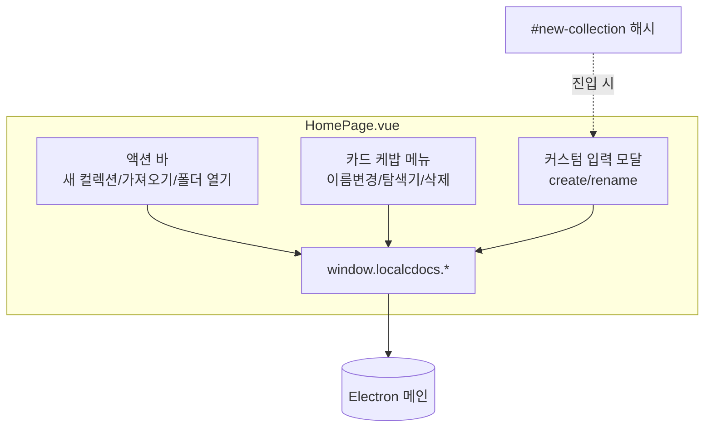
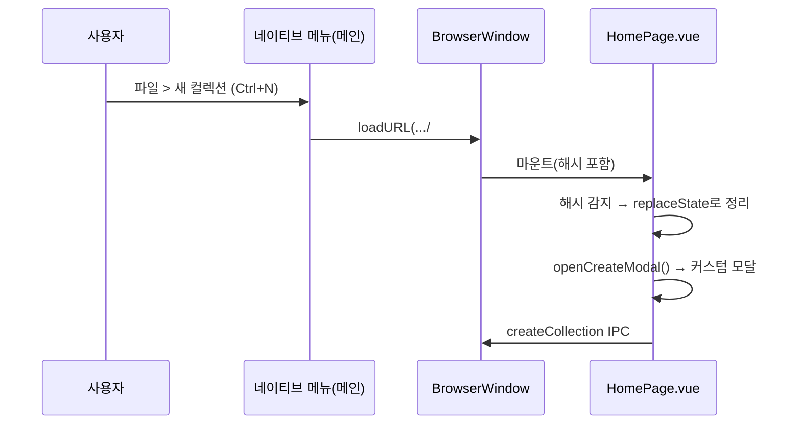

<!-- 10-ipc-and-dashboard.md: 렌더러 대시보드 UI(window.localcdocs/HomePage/커스텀 모달/#new-collection 해시/URL 디코드) | 생성일: 2026-06-22 -->

# 10. IPC와 대시보드 (렌더러 UI)

> 이 문서는 렌더러 측 라이브러리 대시보드를 다룬다. `window.localcdocs` API 표면,
> `HomePage.vue` 대시보드 구조, Electron이 `window.prompt`를 지원하지 않아 도입한 **커스텀 입력 모달**,
> 네이티브 메뉴 '새 컬렉션'과 `#new-collection` 해시 연동, `CategoryDropdown.vue`의 URL 인코딩 처리를
> **실제 코드 발췌**와 함께 설명한다.

관련 문서: [09. 관리형 라이브러리 백엔드](./09-managed-library.md)

---

## 1. window.localcdocs API 표면

대시보드의 모든 관리 동작은 preload가 노출한 `window.localcdocs` 객체를 통해 메인 프로세스로 위임된다(API 정의는 [09 문서 §6](./09-managed-library.md) 참조). 렌더러에서 본 계약은 다음과 같다.

```ts
window.localcdocs = {
  getRoot(): Promise<string>
  createCollection(name): Promise<{ ok, name?, error? }>
  importFolder(): Promise<{ ok, name?, error? }>
  renameCollection(dir, newName): Promise<{ ok, name?, error? }>
  deleteCollection(dir): Promise<{ ok, error? }>
  reveal(dir?): Promise<void>   // dir 없으면 라이브러리 루트
}
```

여기서 `dir`은 컬렉션의 **원본 폴더명**이며 config의 `cat.dir`과 같다(표시용 `cat.label`과 구분).

---

## 2. HomePage 대시보드 구조

`HomePage.vue`는 라이브러리 루트의 `index.md`(`<HomePage />`)가 렌더하는 대시보드다. 데이터는 `config.mts`가 채운 `themeConfig.categories`에서 온다.

```js
// HomePage.vue — <script setup>
const { theme } = useData()

// 컬렉션 목록: config.mts의 themeConfig.categories ({label, path, dir})
const categories = computed(() => theme.value.categories || [])
```

화면은 ① 히어로, ② 액션 바(새 컬렉션/가져오기/폴더 열기), ③ 컬렉션 카드 그리드(카드별 케밥 메뉴), ④ 토스트, ⑤ 입력 모달로 구성된다.



### 2.1 hasApi 폴백 (브라우저 단독 구동)

`window.localcdocs`는 Electron preload에서만 주입된다. 일반 브라우저나 CLI dev 서버로 열면 없으므로, 마운트 시점에 감지해 버튼을 비활성화하고 안내 문구를 띄운다.

```js
// HomePage.vue
// Electron preload 브리지(window.localcdocs). 브라우저/CLI 단독 구동 시 없음 → 폴백.
const api = ref(null)
onMounted(() => {
  if (typeof window !== 'undefined' && window.localcdocs) {
    api.value = window.localcdocs
  }
  // 네이티브 메뉴 '새 컬렉션' 진입(#new-collection) → 모달 자동 오픈 후 해시 정리
  if (typeof window !== 'undefined' && window.location.hash === '#new-collection') {
    history.replaceState(null, '', window.location.pathname)
    openCreateModal()
  }
})
const hasApi = computed(() => !!api.value)
```

템플릿의 모든 액션 버튼은 `:disabled="!hasApi"`로 묶여 있고, API가 없으면 "데스크톱 앱에서 사용 가능합니다." 안내를 보여준다.

```html
<!-- HomePage.vue — 액션 바 -->
<div class="action-bar">
  <button class="btn-brand" :disabled="!hasApi" @click.stop="openCreateModal">+ 새 컬렉션</button>
  <button class="btn-outline" :disabled="!hasApi" @click.stop="onImport">폴더 가져오기</button>
  <button class="btn-outline" :disabled="!hasApi" @click.stop="onOpenLibrary">라이브러리 폴더 열기</button>
  <span v-if="!hasApi" class="api-note">데스크톱 앱에서 사용 가능합니다.</span>
</div>
```

### 2.2 컬렉션 카드 + 케밥 메뉴

카드는 `categories`를 순회하며 렌더된다. 본문 클릭으로 `cat.path`(라우트)로 이동하고, 우측 케밥(⋯)이 이름변경/탐색기/삭제 메뉴를 연다.

```html
<!-- HomePage.vue — 카드 그리드 -->
<div v-for="cat in categories" :key="cat.dir" class="collection-card">
  <div class="card-top">
    <h3 class="card-name">{{ cat.label }}</h3>
    <div v-if="hasApi" class="card-menu-wrap">
      <button class="kebab" title="메뉴" @click.stop="toggleMenu(cat.dir)">⋯</button>
      <div v-if="openMenu === cat.dir" class="card-menu" @click.stop>
        <button @click="openRenameModal(cat)">이름변경</button>
        <button @click="onReveal(cat)">탐색기</button>
        <button class="danger" @click="onDelete(cat)">삭제</button>
      </div>
    </div>
  </div>
  <a :href="cat.path" class="card-open">열기 →</a>
</div>
```

삭제는 `window.confirm`으로 확인을 받는다. (뒤에서 설명하듯 `confirm`/`alert`는 Electron이 지원하므로 그대로 쓴다.) 성공 시 토스트로 "곧 화면이 자동으로 갱신됩니다"를 안내한다 — 실제 갱신은 메인의 chokidar 감지 → 서버 재시작이 처리한다.

```js
// HomePage.vue
async function onDelete(cat) {
  closeMenu()
  if (!hasApi.value) return
  if (!window.confirm(`컬렉션 "${cat.label}"을(를) 삭제할까요? (휴지통으로 이동)`)) return
  try {
    const res = await api.value.deleteCollection(cat.dir)
    if (res && res.ok) showToast(`컬렉션 "${cat.label}"을(를) 삭제했습니다. ${REFRESH_HINT}`)
    else showToast(`삭제 실패: ${(res && res.error) || '알 수 없는 오류'}`)
  } catch (e) {
    showToast(`삭제 실패: ${e.message || e}`)
  }
}
```

---

## 3. 왜 커스텀 모달인가 — window.prompt 미지원

핵심 결정 하나: **Electron의 `BrowserWindow`는 `window.prompt`를 지원하지 않는다.** 호출해도 텍스트 입력 창이 뜨지 않고 `null`을 반환(또는 콘솔 경고)해 이름 입력 UX가 깨진다. 그래서 새 컬렉션 생성과 이름 변경은 `window.prompt` 대신 **컴포넌트 내부 커스텀 모달**로 이름을 입력받는다.

> 반대로 `window.confirm`과 `window.alert`은 Electron이 지원하므로, 위 삭제 확인처럼 그대로 사용한다. 즉 "입력이 필요한 prompt"만 모달로 대체했다.

모달 상태는 `create`/`rename` 모드를 한 객체로 관리하고, 열리면 입력란에 자동 포커스한다.

```js
// HomePage.vue
// ── 이름 입력 모달 ──
// Electron BrowserWindow는 window.prompt를 지원하지 않으므로 커스텀 모달로 이름을 입력받는다.
// mode: 'create'(새 컬렉션) | 'rename'(이름변경). rename은 target(cat)을 함께 보관.
const modal = ref({ open: false, mode: 'create', value: '', target: null, busy: false })
const modalInput = ref(null)
// 모달이 열리면 입력란에 자동 포커스
watch(() => modal.value.open, (open) => {
  if (open) nextTick(() => { if (modalInput.value) modalInput.value.focus() })
})

function openCreateModal() {
  if (!hasApi.value) return
  closeMenu()
  modal.value = { open: true, mode: 'create', value: '', target: null, busy: false }
}
function openRenameModal(cat) {
  if (!hasApi.value) return
  closeMenu()
  modal.value = { open: true, mode: 'rename', value: cat.label, target: cat, busy: false }
}
```

확인 시 모드에 따라 `createCollection` 또는 `renameCollection` IPC를 호출한다. `busy` 플래그로 중복 제출을 막고, 이름이 바뀌지 않은 rename은 조용히 닫는다.

```js
// HomePage.vue
async function confirmModal() {
  const m = modal.value
  const name = (m.value || '').trim()
  if (!name || m.busy || !hasApi.value) return
  modal.value = { ...m, busy: true }
  try {
    if (m.mode === 'create') {
      const res = await api.value.createCollection(name)
      if (res && res.ok) { showToast(`컬렉션 "${name}"을(를) 만들었습니다. ${REFRESH_HINT}`); closeModal() }
      else { showToast(`생성 실패: ${(res && res.error) || '알 수 없는 오류'}`); modal.value = { ...modal.value, busy: false } }
    } else {
      if (name === m.target.dir || name === m.target.label) { closeModal(); return }
      const res = await api.value.renameCollection(m.target.dir, name)
      if (res && res.ok) { showToast(`이름을 "${name}"(으)로 변경했습니다. ${REFRESH_HINT}`); closeModal() }
      else { showToast(`이름변경 실패: ${(res && res.error) || '알 수 없는 오류'}`); modal.value = { ...modal.value, busy: false } }
    }
  } catch (e) {
    showToast(`작업 실패: ${e.message || e}`)
    modal.value = { ...modal.value, busy: false }
  }
}
```

모달 마크업. `Enter`로 확인, `Esc`/배경 클릭으로 닫는다.

```html
<!-- HomePage.vue — 이름 입력 모달 (window.prompt 대체) -->
<Transition name="modal">
  <div v-if="modal.open" class="modal-overlay" @click.self="closeModal">
    <div class="modal-box" @click.stop>
      <h3 class="modal-title">{{ modal.mode === 'create' ? '새 컬렉션' : '이름 변경' }}</h3>
      <input
        ref="modalInput"
        class="modal-input"
        v-model="modal.value"
        :placeholder="modal.mode === 'create' ? '컬렉션 이름' : '새 이름'"
        @keydown.enter="confirmModal"
        @keydown.esc="closeModal"
      />
      <div class="modal-actions">
        <button class="btn-outline" @click="closeModal">취소</button>
        <button class="btn-brand" :disabled="!modal.value.trim() || modal.busy" @click="confirmModal">확인</button>
      </div>
    </div>
  </div>
</Transition>
```

---

## 4. 네이티브 메뉴 '새 컬렉션' ↔ #new-collection 해시 연동

메인 프로세스의 네이티브 메뉴(`파일 > 새 컬렉션...`)도 같은 모달을 써야 한다. 하지만 메뉴 핸들러는 메인 프로세스 코드라 렌더러의 모달을 직접 열 수 없다. 또한 메인에서 `window.prompt`를 띄울 방법도 없다(위와 동일 제약). 해결책: **메인은 대시보드 URL에 `#new-collection` 해시를 붙여 로드**하고, 렌더러가 그 해시를 감지해 모달을 연다.

메인 측 — 메뉴 클릭 시 해시를 붙여 홈으로 이동:

```js
// electron/main.cjs
// 새 컬렉션(네이티브 메뉴용). BrowserWindow는 window.prompt를 지원하지 않으므로,
// 대시보드(홈)로 이동하며 해시(#new-collection)를 붙여 대시보드의 커스텀 입력 모달을 자동으로 연다.
// 실제 생성은 대시보드 모달 → window.localcdocs.createCollection IPC가 담당.
function promptCreateCollection() {
  if (!win || win.isDestroyed() || !currentPort) return
  win.loadURL(`http://127.0.0.1:${currentPort}/#new-collection`).catch(() => {})
}
```

메뉴 등록부:

```js
// electron/main.cjs — buildMenu()
{ label: '새 컬렉션...', accelerator: 'CmdOrCtrl+N', click: () => promptCreateCollection() },
{ label: '폴더 가져오기...', click: () => pickAndImportFolder() },
{ label: '라이브러리 폴더 열기', click: () => revealCollection() },
```

렌더러 측 — `onMounted`에서 해시를 감지해 모달을 열고, 주소창에 해시가 남지 않도록 `replaceState`로 정리한다(§2.1 코드의 후반부).

```js
// HomePage.vue — onMounted()
if (typeof window !== 'undefined' && window.location.hash === '#new-collection') {
  history.replaceState(null, '', window.location.pathname)
  openCreateModal()
}
```

흐름 정리:



---

## 5. CategoryDropdown의 URL 인코딩 처리

`CategoryDropdown.vue`는 현재 라우트가 어느 컬렉션에 속하는지 판별해 드롭다운 라벨을 정한다. 문제는 폴더명에 공백·괄호 등이 있으면 `route.path`가 **URL 인코딩**된다는 점이다(예: 폴더 `docs (2)` → 경로 `/docs%20(2)/...`). 그대로 `cat.dir`(`docs (2)`)과 비교하면 `%20` 때문에 매칭이 실패한다.

해결: 비교 전에 `decodeURIComponent`로 경로를 디코드한다. 매칭은 표시용 `label`이 아니라 **원본 폴더명 `dir`** 기준으로 한다(URL 경로와 일치하기 때문).

```js
// CategoryDropdown.vue
const currentCategory = computed(() => {
  // 폴더명에 공백/괄호 등이 있으면 route.path가 URL 인코딩(%20 등)되므로 디코드 후 비교한다.
  // (예: 폴더 'docs (2)' → 경로 '/docs%20(2)/...' → 디코드해야 dir 'docs (2)'와 매칭)
  let path = route.path
  try { path = decodeURIComponent(path) } catch {}
  for (const cat of categories.value) {
    // dir = 원본 폴더명(URL 경로와 일치). label은 표시용이라 경로 매칭에 쓰지 않는다.
    const dir = cat.dir || cat.label
    if (path.startsWith('/' + dir + '/') || path === '/' + dir) return cat.label
  }
  return categories.value[0]?.label || ''
})
```

포인트:

- `decodeURIComponent`는 `try/catch`로 감싼다 — 잘못 인코딩된 경로에서 예외가 나도 원본 경로로 폴백한다.
- 매칭은 `dir`로, 화면 표시는 `label`로 분리해, 같은 라벨을 갖는 서로 다른 폴더(예: `docs`, `docs-2`)도 경로로 정확히 구분된다.
- `startsWith('/' + dir + '/')`로 하위 페이지까지, `=== '/' + dir`로 컬렉션 루트까지 모두 매칭한다.

> 백엔드 연계: 메인의 `uniqueDest`가 충돌 시 접미사를 `' (2)'`가 아니라 **공백 없는 `-2`**로 붙이는 것도 같은 URL 인코딩 문제를 줄이기 위한 선택이다([09 문서 §4.3](./09-managed-library.md)).
