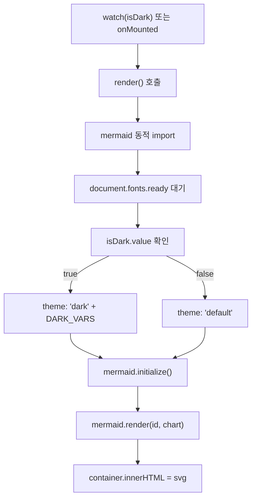

<!-- 11-theming-and-mermaid.md: 민트 테마 커스터마이징 및 Mermaid 다크모드 문제 해결 | 생성일: 2026-06-22 -->

# 11. 테마 커스터마이징과 Mermaid

이 문서는 VitePress 테마의 민트 색상 시스템, 다크모드 변수, 코드블록 고대비 설정,
그리고 Mermaid 다이어그램에서 겪은 **글자 잘림**과 **다크모드 미적용** 문제의 해결 과정을 기술합니다.

실제 코드는 아래 두 파일에 있습니다.
- `vitepress-core/.vitepress/theme/style.css`
- `vitepress-core/.vitepress/theme/components/Mermaid.vue`

---

## 1. 민트 테마 색상 시스템

VitePress의 CSS 변수를 재정의해 민트 계열 브랜드 색을 적용합니다.

### 라이트 모드 (`style.css`)

```css
/* ── Light 모드: 민트 테마 ── */
:root {
  --vp-c-brand-1: #11999e;
  --vp-c-brand-2: #0e8589;
  --vp-c-brand-3: #0b7174;
  --vp-c-brand-soft: rgba(17, 153, 158, 0.14);

  --vp-c-bg: #f3f6f6;
  --vp-c-bg-alt: #eaf0f0;
  --vp-c-bg-elv: #ffffff;
  --vp-c-bg-soft: #eaf5f5;

  --vp-c-text-1: #40514e;
  --vp-c-text-2: #6b7a77;
  --vp-c-text-3: #8a9290;
}
```

### 다크 모드 (`style.css`)

다크 배경을 `#1a1f1e`(깊은 민트-회)로 설정하고, 브랜드 색은 밝은 민트(`#30e3ca`)로 반전합니다.

```css
/* ── Dark 모드: 민트 테마 ── */
.dark {
  --vp-c-brand-1: #30e3ca;
  --vp-c-brand-2: #28c8b0;
  --vp-c-brand-3: #20ad96;
  --vp-c-brand-soft: rgba(48, 227, 202, 0.14);

  --vp-c-bg: #1a1f1e;
  --vp-c-bg-alt: #161a19;
  --vp-c-bg-elv: #222827;
  --vp-c-bg-soft: #242a29;

  --vp-c-border: rgba(48, 227, 202, 0.12);
  --vp-c-divider: rgba(48, 227, 202, 0.08);
}
```

`--vp-c-bg-elv: #222827`은 Mermaid 래퍼 배경에도 그대로 사용되어
다이어그램 컨테이너가 페이지 배경과 자연스럽게 구분됩니다.

---

## 2. 코드블록 다크 고대비

VitePress 기본 다크 코드블록 배경은 본문 배경과 구분이 약합니다. 거의 검정에 가까운 배경(`#0d1117`)으로 교체해 대비를 높입니다.

```css
/* ── 코드블록: 라이트=흰색 배경, 다크=고대비 ── */
:root {
  --vp-code-block-bg: #ffffff;
  --vp-code-bg: rgba(17, 153, 158, 0.08);
}
.dark {
  --vp-code-block-bg: #0d1117;
  --vp-code-bg: rgba(48, 227, 202, 0.1);
}
/* 다크모드에서만 밝은 텍스트 */
.dark .vp-doc div[class*='language-'] code {
  color: #e4e4e7;
}
```

인라인 코드도 다크에서 민트 색으로 강조합니다.

```css
.dark .vp-doc :not(pre) > code {
  background-color: rgba(48, 227, 202, 0.12) !important;
  color: #30e3ca !important;
  border-color: rgba(48, 227, 202, 0.2);
}
```

---

## 3. Mermaid 다크모드 색상 (`Mermaid.vue`)

### 문제: 다크모드에서 박스가 배경과 구분되지 않음

Mermaid 기본 `dark` 테마는 배경을 `#1e1e1e`로 사용하는데, 우리 테마의 `--vp-c-bg-elv: #222827`과 명도가 거의 같아 노드 경계가 사라집니다.

### 해결: themeVariables로 민트 팔레트 직접 지정

`Mermaid.vue`에서 `DARK_VARS` 객체를 정의해 다크 테마 변수를 덮어씁니다.

```js
// Mermaid.vue — DARK_VARS 전체
const DARK_VARS = {
  darkMode: true,
  background: '#222827',
  primaryColor: '#33403e',
  primaryBorderColor: '#30e3ca',
  primaryTextColor: '#eaf1ee',
  secondaryColor: '#2c3a37',
  tertiaryColor: '#3a4845',
  lineColor: '#9aa7a3',
  textColor: '#d6dcda',
  // sequence diagram
  actorBkg: '#33403e',
  actorBorder: '#30e3ca',
  actorTextColor: '#eaf1ee',
  actorLineColor: '#9aa7a3',
  signalColor: '#cdd5d2',
  signalTextColor: '#eaf1ee',
  labelBoxBkgColor: '#33403e',
  labelBoxBorderColor: '#30e3ca',
  labelTextColor: '#eaf1ee',
  loopTextColor: '#eaf1ee',
  noteBkgColor: '#3a4845',
  noteTextColor: '#eaf1ee',
  noteBorderColor: '#30e3ca',
  altSectionBkgColor: '#2a322f',
  activationBkgColor: '#3a4845',
}
```

`primaryBorderColor: '#30e3ca'`(민트)로 노드 테두리를 밝게, `primaryColor: '#33403e'`로 노드 채움을 배경보다 약간 밝게 설정해 flowchart·sequence 다이어그램 모두 커버합니다.

`isDark` 반응성은 VitePress의 `useData()`로 가져오고, `watch(isDark, render)`로 모드 전환 시 즉시 재렌더합니다.

```js
// Mermaid.vue
const { isDark } = useData()

mermaid.initialize({
  startOnLoad: false,
  theme: dark ? 'dark' : 'default',
  themeVariables: dark ? DARK_VARS : undefined,
  ...
})

onMounted(render)
watch(isDark, render)
```

---

## 4. Mermaid 글자 잘림 해결

### 문제 1: 페이지 line-height 상속

본문 `line-height: 1.85`가 Mermaid의 `foreignObject` 안 HTML 라벨에 상속됩니다. 라벨 텍스트가 측정된 박스 높이보다 커져 **마지막 줄이 잘립니다**.

### 해결 1: style.css — .mermaid-wrapper 셀렉터로 리셋

```css
/* style.css */
/* 페이지 본문 line-height(1.85)가 mermaid HTML 라벨(foreignObject)에 상속되면
   글자가 박스 높이보다 커져 마지막 줄이 잘린다. 라벨 내부는 타이트하게 리셋. */
.mermaid-wrapper foreignObject,
.mermaid-wrapper foreignObject *,
.mermaid-wrapper .nodeLabel,
.mermaid-wrapper .edgeLabel,
.mermaid-wrapper .label,
.mermaid-wrapper span,
.mermaid-wrapper p,
.mermaid-wrapper div {
  line-height: 1.3 !important;
}
```

### 해결 2: themeCSS — Mermaid 내부 렌더/측정 단계도 리셋

CSS 파일 재정의만으로는 Mermaid가 SVG 크기를 계산하는 **내부 측정 단계**에서 이미 1.85가 적용됩니다. `themeCSS` 옵션으로 Mermaid 내부에도 직접 주입합니다.

```js
// Mermaid.vue — mermaid.initialize()
themeCSS: '.nodeLabel,.edgeLabel,.label,.nodeLabel p,foreignObject div,foreignObject span{line-height:1.3 !important;}',
```

두 곳에서 리셋하는 이유: style.css는 DOM에 삽입된 SVG에 적용되고, themeCSS는 Mermaid가 SVG를 생성하는 시점에 적용됩니다. 어느 한 쪽만 해도 여전히 잘림이 남을 수 있습니다.

---

## 5. 웹폰트 로드 타이밍 — document.fonts.ready

### 문제 2: 폰트 로드 전 측정

SUITE Variable 웹폰트가 아직 로드되지 않은 상태에서 Mermaid가 텍스트 폭을 측정하면 폴백 폰트(시스템 폰트) 기준으로 박스가 잡힙니다. 폰트가 뒤늦게 로드되면 텍스트가 박스를 넘쳐 잘립니다.

### 해결: document.fonts.ready 대기 후 렌더

```js
// Mermaid.vue — render() 함수 내부
if (typeof document !== 'undefined' && document.fonts && document.fonts.ready) {
  try { await document.fonts.ready } catch {}
}
```

`document.fonts.ready`는 모든 웹폰트 로드가 완료된 뒤 resolve되는 Promise입니다. 이 시점에 Mermaid를 렌더하면 실제 렌더 폰트와 측정 폰트가 일치해 박스 크기 오차가 없습니다.

### 폰트 패밀리 명시

`fontFamily: 'inherit'`을 쓰면 Mermaid 내부 측정 폰트와 CSS 렌더 폰트가 달라질 수 있습니다. 구체 폰트명을 직접 지정합니다.

```js
// Mermaid.vue
fontFamily: '"SUITE Variable", -apple-system, BlinkMacSystemFont, "Segoe UI", "Malgun Gothic", sans-serif',
```

CSS의 `--vp-font-family-base`와 동일한 폴백 체인을 유지해 측정-렌더 불일치를 방지합니다.

---

## 6. Mermaid.vue 전체 흐름 요약



---

## 7. 다크모드 토글 동기화 주의사항

메뉴에서 다크모드를 토글할 때 `document.documentElement.classList.toggle('dark')`만 호출하면
VitePress 내부의 `isDark`(ref)와 `localStorage`의 `vitepress-theme-appearance` 값이 갱신되지 않습니다.
이 상태에서 Mermaid의 `watch(isDark, render)`가 발동하지 않아 다이어그램이 라이트 테마로 남습니다.

올바른 방법은 VitePress의 정식 스위치 버튼(`.VPSwitchAppearance`)을 프로그래밍으로 클릭하거나,
사용자가 우상단의 기본 다크모드 토글 버튼을 사용하는 것입니다.

```js
// CustomLayout.vue — 메뉴 다크 토글 (올바른 방법)
document.querySelector('.VPSwitchAppearance')?.click()
// classList.toggle('dark') 단독 사용 금지 — isDark 미갱신으로 Mermaid 재렌더 안 됨
```
